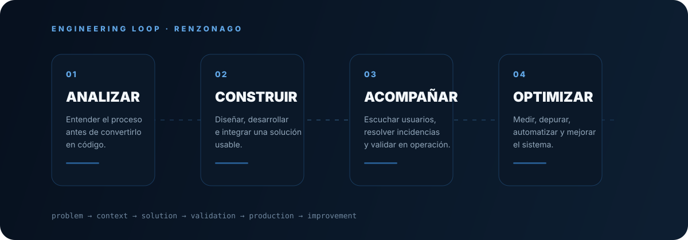

### Ingeniero en Sistemas Computacionales · Desarrollador Full Stack

  
  
  

> **Me gusta entender el problema antes de escribir el código.**
> Cuando el software entra en operación, empieza la siguiente etapa: escuchar, corregir y mejorar.

---

---

## 01 · QUIÉN SOY

Soy **Desarrollador Full Stack** con enfoque en software empresarial, automatización y datos.

Mi experiencia se ha construido alrededor de problemas concretos: procesos manuales, información dispersa, usuarios que necesitan una herramienta que realmente les funcione y sistemas que tienen que mantenerse estables después del desarrollo.

Por eso mi perfil mezcla:

`software` · `procesos` · `datos` · `usuarios` · `producción`

No me interesa solamente implementar una funcionalidad; me interesa entender **qué proceso cambia** cuando esa funcionalidad existe.

---

## 02 · LO QUE HE CONSTRUIDO

<table>
<tr>
<td align="center" width="25%">

### +200K

**registros**

Migración, depuración y estructuración de información empresarial.

</td>
<td align="center" width="25%">

### 2–3 h

**proceso**

Un flujo operativo transformado en una solución centralizada.

</td>
<td align="center" width="25%">

### ERP

**producción**

Software empresarial utilizado en operación real.

</td>
<td align="center" width="25%">

### 2K+

**diseños**

Procesamiento de imágenes en IACOW.

</td>
</tr>
</table>

---

## 03 · EXPERIENCIA REAL

### JCB AZTECA · JVJ Technology

**Desarrollador Full Stack · Diciembre 2024 – Octubre 2026**

Una experiencia centrada en construir y mantener un ERP para **servicios, almacén, ventas y administración**.

**Lo que hice alrededor del sistema**
- desarrollé y evolucioné módulos;
- digitalicé flujos de servicios técnicos;
- trabajé con migración y estructuración de datos;
- construí dashboards y KPIs;
- integré APIs y automatizaciones;
- generé reportes PDF y procesamiento de XML;
- atendí incidencias y soporte en producción;
- capacitando y acompañando a usuarios;
- utilicé IA para análisis, debugging, optimización y documentación.

`PHP` `Laravel` `JavaScript` `MySQL` `APIs` `ERP`

---

## 04 · DOS PROYECTOS QUE REPRESENTAN MI PERFIL

<table>
<tr>
<td width="50%" valign="top">

### ERP JCB AZTECA

**Construir para operación real.**

ERP + servicios técnicos + inventario + datos + dashboards + soporte.

<a href="https://renzonago.github.io/site/projects/jcb/"><b>→ Ver caso de estudio</b></a>

</td>
<td width="50%" valign="top">

### IACOW

**Construir una solución alrededor de un problema específico.**

Django + PostgreSQL + procesamiento de imágenes + automatización.

<a href="https://renzonago.github.io/site/projects/iacow/"><b>→ Ver caso de estudio</b></a>

</td>
</tr>
</table>

---

## 05 · MI STACK

### Backend
`PHP` `Laravel` `Phalcon` `Python` `Django` `REST` `JSON`

### Frontend
`HTML` `CSS` `JavaScript` `React` `TypeScript` `Bootstrap`

### Data
`MySQL` `PostgreSQL` `SQLite` `MariaDB` `XML`

### Engineering
`Git` `GitHub` `PDF Automation` `Data Migration` `Dashboards` `APIs`

### IA aplicada
`analysis` · `debugging` · `logic optimization` · `documentation`

---

## 06 · CÓMO PIENSO

### 01 — Analizar

Antes de programar intento entender el proceso, el contexto y la causa del problema.

### 02 — Construir

Después convierto ese entendimiento en una solución concreta, no solamente en una pieza de código.

### 03 — Acompañar

La solución se valida con quienes realmente la utilizan. Aquí entran soporte, capacitación y comunicación.

### 04 — Optimizar

Cuando el sistema entra en uso aparecen nuevos datos, problemas y oportunidades. Ahí empieza la mejora continua.

---

## 07 · IA: PARTE DEL PROCESO, NO SUSTITUTO DEL CRITERIO

Trabajo con IA de forma intensiva, pero el flujo parte de mi propio análisis:

`Problema → contexto → hipótesis → IA → pruebas → validación → implementación`

La utilizo especialmente para:
- investigar alternativas;
- razonar sobre bugs;
- revisar lógica;
- analizar datos y flujos;
- acelerar implementación y refactorización;
- mejorar documentación.

Trabajo principalmente con **ChatGPT y Claude** y verifico/adapto sus propuestas antes de incorporarlas a un sistema.

---

## 08 · EN CONSTRUCCIÓN

Actualmente estoy ampliando mi stack con **React y TypeScript** y desarrollando proyectos propios para seguir experimentando con arquitectura, interfaces, automatización y nuevas formas de construir software.

`LEARN → BUILD → TEST → REPEAT`

---

## 09 · FORMACIÓN

**Ingeniería en Sistemas Computacionales**  
Instituto Tecnológico Superior de Macuspana · 2024

**Técnico en Informática**  
Instituto de Difusión Técnica N.7

**Inglés:** B1

---

### ¿Qué estoy buscando?

**Seguir construyendo software útil, aprender tecnologías nuevas y trabajar cerca de problemas reales.**

 

  

Casos de estudio, evidencia y documentación técnica → <a href="https://renzonago.github.io/site/">renzonago.github.io/site/</a>

