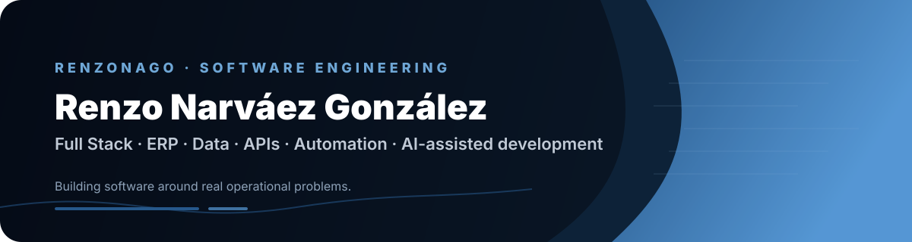

### Ingeniero en Sistemas Computacionales · Desarrollador Full Stack

  
  
  

---

## 01 · PERFIL

Desarrollador Full Stack orientado a **software empresarial, digitalización de procesos y datos**.

He participado en el diseño, desarrollo, evolución y soporte de sistemas utilizados en operación real, con experiencia en **ERP, migración de información, dashboards, APIs, automatización y atención directa a usuarios**.

Mi forma de trabajar combina análisis del problema, desarrollo, validación con usuarios y mejora continua.

> **No busco solamente que el software funcione. Busco que resuelva el proceso para el que fue construido.**

---

## 02 · IMPACTO

<table>
<tr>
<td align="center" width="25%">

### +200K

registros migrados y estructurados

</td>
<td align="center" width="25%">

### 2–3 h

proceso operativo transformado

</td>
<td align="center" width="25%">

### ERP

software empresarial en producción

</td>
<td align="center" width="25%">

### 2024

IACOW · etapa nacional

</td>
</tr>
</table>

---

## 03 · EXPERIENCIA

### JCB AZTECA · JVJ Technology
**Desarrollador Full Stack · Diciembre 2024 – Octubre 2026 · Villahermosa, Tabasco**

`PHP` `Laravel` `JavaScript` `MySQL` `APIs` `ERP`

Trabajé sobre una plataforma ERP orientada a **servicios, almacén, ventas y administración**, participando en distintas etapas del ciclo de vida del sistema.

**Desarrollo**
- Creación y evolución de módulos orientados a necesidades operativas.
- Digitalización del flujo de servicios técnicos.
- Integración de APIs, reportes PDF, automatizaciones y validaciones.

**Datos**
- Migración, depuración y estructuración de **más de 200,000 registros**.
- Procesamiento de información empresarial, XML, inventario, clientes, unidades y ventas.

**Operación**
- Dashboards y KPIs para análisis de ventas, inventario y operación.
- Soporte técnico, diagnóstico de incidencias y ajustes funcionales.
- Capacitación y comunicación directa con usuarios y equipos operativos.

**IA aplicada**
- Uso de IA como apoyo para análisis, depuración, optimización de lógica y documentación técnica.

---

## 04 · PROYECTOS DESTACADOS

<table>
<tr>
<td width="50%" valign="top">

### ERP JCB AZTECA

Plataforma ERP orientada a la operación empresarial.

`ERP` `Servicios` `Inventario` `Datos` `Dashboards` `APIs`

**Enfoque:** desarrollo de módulos, soporte, usuarios y producción.

<a href="https://renzonago.github.io/site/projects/jcb/">→ Ver caso de estudio</a>

</td>
<td width="50%" valign="top">

### IACOW · Sistema de Gestión Ganadera

Sistema web desarrollado para la Asociación Ganadera Local de Macuspana.

`Python` `Django` `PostgreSQL` `Vision`

**Resultados:** +2,000 diseños procesados y proyecto presentado en la etapa nacional de INNOVATECNM 2024.

<a href="https://renzonago.github.io/site/projects/iacow/">→ Ver caso de estudio</a>

</td>
</tr>
</table>

---

## 05 · STACK

### Backend
`PHP` `Laravel` `Phalcon` `Python` `Django` `REST` `JSON`

### Frontend
`HTML` `CSS` `JavaScript` `React` `TypeScript` `Bootstrap`

### Data
`MySQL` `PostgreSQL` `SQLite` `MariaDB` `XML`

### Engineering
`Git` `GitHub` `PDF Automation` `Data Migration` `Dashboards` `APIs`

### AI
`AI-assisted development` · análisis · debugging · optimización · documentación

---

## 06 · CÓMO TRABAJO

<table>
<tr>
<td align="center" width="25%">

### 01

**ANALIZAR**

Entender el problema, el flujo y el contexto.

</td>
<td align="center" width="25%">

### 02

**CONSTRUIR**

Convertir la necesidad en una solución funcional.

</td>
<td align="center" width="25%">

### 03

**ACOMPAÑAR**

Validar con usuarios, resolver incidencias y capacitar.

</td>
<td align="center" width="25%">

### 04

**OPTIMIZAR**

Medir, corregir y mejorar a partir del uso real.

</td>
</tr>
</table>

---

## 07 · IA COMO HERRAMIENTA DE INGENIERÍA

Utilizo IA de forma integrada en mi proceso de desarrollo, principalmente como **herramienta de análisis y validación**, no como sustituto del criterio técnico.

**Mi flujo habitual:**

`Problema → análisis propio → documentación/contexto → propuesta → IA → pruebas → validación → implementación`

La utilizo especialmente para:

- detectar y razonar sobre bugs;
- revisar lógica y alternativas;
- analizar datos y flujos;
- acelerar implementación y refactorización;
- generar y mejorar documentación técnica.

Trabajo principalmente con **ChatGPT y Claude**, verificando y adaptando sus propuestas antes de incorporarlas al sistema.

---

## 08 · FORMACIÓN

**Ingeniería en Sistemas Computacionales**  
Instituto Tecnológico Superior de Macuspana · 2024

**Técnico en Informática**  
Instituto de Difusión Técnica N.7

**Inglés:** B1

---

## 09 · CONTACTO

**Disponible para oportunidades profesionales, colaboración y nuevos proyectos.**

  

El portafolio contiene los casos de estudio completos, evidencia visual y documentación de los proyectos.

